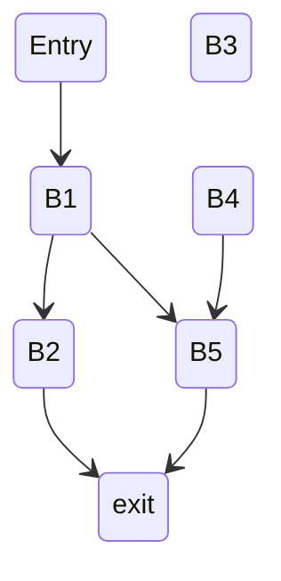
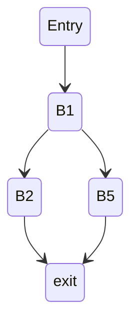

## **编译原理**

### MiniDecaf 编译器实验报告 -- STAGE 3

2021010706 岳章乔

#### 一、 思考题

##### step 7:

1.

(以本人的 mind 编译器生成的中间代码为例)

```
_main:
    T1 <- 2
    T0 <- T1
    T2 <- 3
    T3 <- (T0 < T2)
    if (T3 == 0) jump __L1
    T5 <- 3
    T4 <- T5
    return T4
    return T0
    jump   __L2
__L1:
__L2:
    T6 <- 0
    return T6
```

有下列的基本块划分：

```
# (B1):
_main:
    T1 <- 2
    T0 <- T1
    T2 <- 3
    T3 <- (T0 < T2)
    if (T3 == 0) jump __L1
# (B2):
    T5 <- 3
    T4 <- T5
    return T4
# (B3):
    return T0
# (B4):
    jump   __L2
__L1:
__L2:
# (B5):
    T6 <- 0
    return T6
```


数据流图：




如果把不可达的基本块删除，就是：



其对应

```
# (B1):
_main:
    T1 <- 2
    T0 <- T1
    T2 <- 3
    T3 <- (T0 < T2)
    if (T3 == 0) jump __L1
# (B2):
    T5 <- 3
    T4 <- T5
    return T4
__L1:
# (B5):
    T6 <- 0
    return T6
```

##### step 8:

1.

按汇编指令的行数，理应是第一种会比较好，但按实际上执行过的指令条数，其实两者是等价的。

第一种更接近于原生的 while 循环的翻译，第二种更像是把 while 变换为 do-while 后的中间代码表示：

如果 while 循环有以下形式：

```
while(condition)
	body
```

那么其对应的 do-while 就有以下形式：

```
if(condition)
	do body
	while(condition)
```


类似的变换其实也可以推广到其他循环形式 -- 比如这次实验的 for 的实现，实际上是在前端的语法分析阶段，在语义行为的部分将之转换为 while 循环。

#### 二、实验内容

###### 2.0. 约定

parser.y

非终结符 `ForStmt` 代表 for 循环语句，`NExpr` 代表可空 (nullable) 表达式。

##### 2.1. 实验需求

实现多层作用域；实现 for 循环和 continue 语句。

##### 2.2. 具体实现

###### 2.3.1. 词法分析

step 8:

（**更改1**）补全 `frontend/scanner.l` 的单词表，本次更新针对 for 循环和 continue 语句，分别增加对应的终结符，并将之同步到 parser.y。

###### 2.3.2. 语法分析

修改 `frontend/parser.y` 产生式的定义。

step 8:

（**更改2**） 在 `frontend/parser.y` 增加非终结符 `ForStmt` 的产生式，在语义行为部分转换为 While 循环；同时在 while 语句类增加 for 循环属性的字段（构造函数最后的 true），其大概转换思想如下（关于 true 的字段是防止在 continue 跳转的时候忽略 step 语句）。

```
for(init; cond; step)
	body
is equivalent to
init;
while(cond) {
	body
	continue_tag:
	step;
}
```

（**更改3**） 实现 continue 语句，具体类比 break 语句的实现。

```
CONTINUE SEMICOLON
                { $$ = new ast::ContStmt(POS(@1));}
```

（**更改4**）在 `ast/ast_while_stmt.cpp` 实现 continue 语句类的声明和遍历函数：

```c++
ContStmt::ContStmt(Location *l){
    setBasicInfo(CONTINUE_STMT, l);
}

void ContStmt::accept(Visitor *v){
    v->visit(this);
}
```

（**更改5**） 实现 do-while 的语法分析，类似于 for 语句。

###### 2.3.3. 语义分析

step 7:

（**更改6**）编译器第一次遍历语法树，构造符号表，修改 `translation/build_sym.cpp` 对`CompStmt` 的实现，具体如下。

```c++
Scope *scope = new LocalScope();
c->ATTR(scope) = scope;
scopes->open(scope);

// adds the local variables
for (auto it = c->stmts->begin(); it != c->stmts->end(); ++it)
    (*it)->accept(this);

// closes function scope
scopes->close();
```

###### 2.3.4. 中间代码生成

编译器第三次遍历 AST，生成中间三地址代码：

需要修改 `translation/translation.hpp` 和 `translation/translation.cpp` ，把 继续循环 节点翻译为三地址码。

（**更改7**）标记 `continue` 实际跳转位置，即循环开始标记。

先在 `translation/translation.hpp` 定义该标记：

```c++
tac::Label current_continue_label;
```

（**更改8**）在 While 语句翻译阶段，记录 continue 的标记；

（**更改9** ) 在 While 语句阶段，增加 for 循环的跳转标记处理。

（**更改10**）在 `translation/translation.cpp` 实现 continue 语句的翻译（同时在头文件补充声明）：

```c++
void Translation::visit(ast::ContStmt *s) {
    tr->genJump(current_continue_label);
}
```


###### 2.3.5. 中间代码优化

略。

###### 2.3.6. 目标代码生成

略